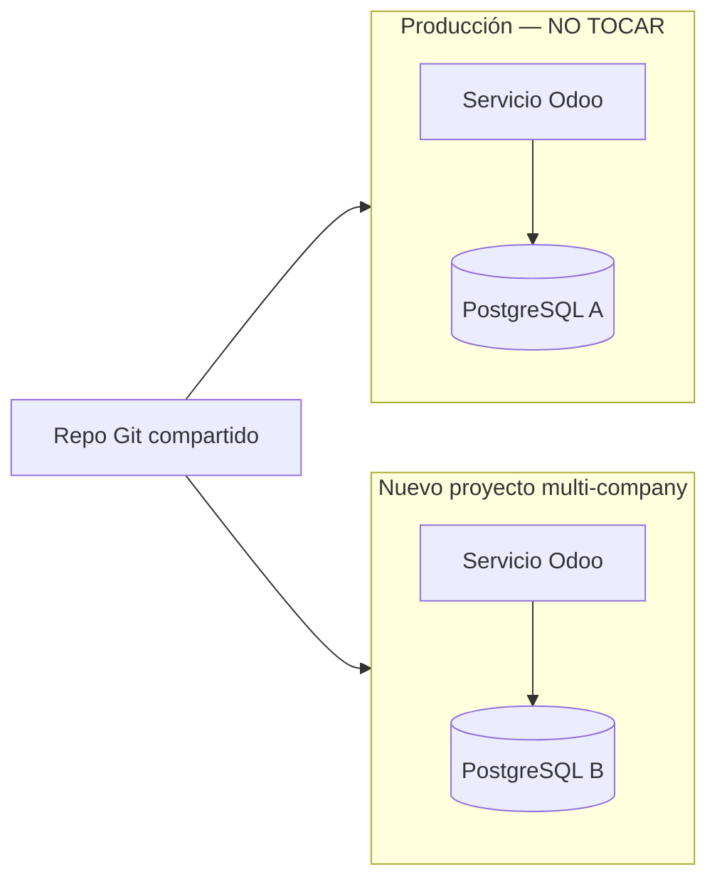

# Despliegue multi-company (sin romper producción single-tenant)

Esta guía explica **qué hacer** para poner en marcha la plataforma multi-company (una BD, varias `res.company`) **sin afectar** la instancia single-tenant que ya tienes en producción.

## Regla de oro

| Instancia | Railway | PostgreSQL | Qué hacer |
|-----------|---------|------------|-----------|
| **Producción actual (single-tenant)** | Proyecto existente | Su propia BD | **No cambiar variables ni dominio.** Sigue igual. |
| **Nueva plataforma (multi-company)** | **Proyecto nuevo** | **Postgres nuevo** | Crear desde cero con las variables de abajo. |

El mismo repositorio Git sirve para ambos. Lo que separa el comportamiento son las **variables de entorno** y el **proyecto Railway**, no el código en sí.



---

## Parte 1 — Proteger la instancia single-tenant (producción)

### Qué NO hacer en el proyecto de producción

No modifiques el proyecto Railway actual ni su Postgres. En concreto:

| Variable / acción | En producción single-tenant |
|-------------------|----------------------------|
| `ODOO_MULTI_COMPANY_S3` | **No definir** |
| `ODOO_EXTRA_INIT_MODULES` con `company_onboarding` | **No usar** |
| Compartir `DATABASE_URL` con el proyecto nuevo | **No** |
| Mismo dominio para ambos proyectos | **No** |
| Instalar módulo `company_onboarding` en esa BD | **No** (signup público + wizard no aplican ahí) |

### Qué puede seguir igual en producción

Tras hacer merge del código multi-company al repo, la producción single-tenant **sigue funcionando** si mantienes su configuración habitual:

```bash
DATABASE_URL=<tu Postgres de producción>
DB_PASSWORD_ADMIN=<tu secreto actual>
DB_LANGUAGE=es_ES
DB_WITH_DEMO=false
ODOO_PROXY_MODE=true
ODOO_LIST_DB=false
# S3 opcional, sin ODOO_MULTI_COMPANY_S3:
# ODOO_ATTACHMENT_STORAGE=s3
# ORDER_BRIDGE_BANNER_S3_BUCKET=...
```

`DB_USERNAME` y `GUNICORN_WORKERS` no hace falta definirlos: el entrypoint usa `admin` y la imagen Docker ya arranca con 2 workers.

- Un solo `DATABASE_URL` → una sola BD (como ahora).
- `docker-entrypoint.sh` hace `db init` / `-u base` solo sobre **esa** BD.
- Los cambios en `order_bridge` / `bi_analytics` son compatibles con la APK legacy: **no** exigen `company_slug` mientras `ODOO_MULTI_COMPANY_S3` no esté definido (fallback a `base.main_company` aunque haya más de una compañía activa).

### Checklist rápido — producción intacta

- [ ] No he tocado variables del proyecto Railway de producción.
- [ ] No he enlazado el Postgres de producción al proyecto nuevo.
- [ ] No he puesto `ODOO_MULTI_COMPANY_S3` en producción.
- [ ] Tras un deploy de prueba en producción: `/web/health` → 200 y login normal.

### Dispositivos existentes (single-tenant)

La APK de producción **no se actualiza**: no envía `company_slug` ni `X-Company-Slug`. Mientras `ODOO_MULTI_COMPANY_S3` **no** esté definido, register y catálogo anónimo usan `base.main_company` aunque existan varias `res.company` activas. El error `company_slug_required` **solo** aplica en el proyecto multi-company (`ODOO_MULTI_COMPANY_S3=true`). Pedidos y status con `device_key` usan `device.company_id` (`sudo()` ignora las reglas de compañía).

Si ves `{"error": "company_slug_required"}` en single-tenant **antes** de este fix, suele ser porque hay más de una compañía activa:

```sql
SELECT id, name, active FROM res_company WHERE active = true;
```

Tras el deploy con el fallback, esa query es informativa (la APK ya no falla). En Railway, confirma que el servicio de producción **no** tiene `ODOO_MULTI_COMPANY_S3=true`.

El riesgo está en el **backend**: Tienda Apk → Dispositivos (filtro «Pendiente de validación»). La `ir.rule` `company_id in company_ids` **oculta** filas con `company_id` vacío. El cliente sigue comprando en la app, pero el admin no puede validar el teléfono.

Al actualizar `order_bridge` a **19.0.1.1.0**, el script [`migrations/19.0.1.1.0/post-migrate.py`](../own_modules/order_bridge/migrations/19.0.1.1.0/post-migrate.py) asigna `base.main_company` a dispositivos (y partners vinculados) sin compañía.

Comprobar **antes** (copia de BD o staging):

```sql
SELECT id, phone, phone_validated, active, company_id
FROM order_bridge_device
WHERE company_id IS NULL;

SELECT id, phone
FROM order_bridge_device
WHERE company_id IS NULL
  AND phone_validated = false
  AND active = true;
```

Tras el deploy (`-u order_bridge` o el entrypoint con `-u base`): esas queries deben devolver **0 filas**.

Checklist post-deploy single-tenant:

- [ ] No instalar `company_onboarding` ni definir `ODOO_MULTI_COMPANY_S3`.
- [ ] Railway: `ODOO_MULTI_COMPANY_S3` **ausente** (no `true`).
- [ ] 0 dispositivos con `company_id IS NULL`.
- [ ] Tienda Apk → Dispositivos → «Pendiente de validación»: aparecen los mismos que antes.
- [ ] APK: registro / catálogo / status / pedido sin header ni slug → 200.

Plan B (shell Odoo, solo si hay **una** compañía y la migración no corrió):

```python
company = env.ref('base.main_company')
env['order_bridge.device'].sudo().search([('company_id', '=', False)]).write({'company_id': company.id})
```

---

## Parte 2 — Crear el proyecto multi-company (nuevo)

### Paso 1 — Railway

1. [Railway Dashboard](https://railway.com/dashboard) → **New Project**.
2. Añade **PostgreSQL** (nuevo, no el de producción).
3. Añade servicio **Docker** desde este repo (rama que tenga el código multi-company).
4. Enlaza `DATABASE_URL` del Postgres **de este proyecto** al servicio Odoo.
5. Puerto expuesto: **8069**.

### Paso 2 — Variables de entorno (proyecto nuevo)

Copia en Railway **Variables** del servicio Odoo (valores nuevos, no reutilices los de producción):

```bash
# Obligatorias (init de BD)
DATABASE_URL=<referencia al Postgres DE ESTE proyecto>
DB_PASSWORD_ADMIN=<secreto-fuerte NUEVO>
DB_LANGUAGE=es_ES
DB_WITH_DEMO=false

# Lo que distingue este proyecto del single-tenant
# ODOO_MULTI_COMPANY_S3 activa slug obligatorio en la API y el prefijo S3 {company_id}
ODOO_MULTI_COMPANY_S3=true
# Primer boot: instala módulos que db init no trae. company_onboarding
# instala order_bridge como dependencia. bi_analytics es el stack de reportes
# (opcional para el aislamiento; sí lo quieres en la plataforma).
ODOO_EXTRA_INIT_MODULES=company_onboarding,fs_attachment,bi_analytics

# S3 compartido con prefijo por compañía (recomendado)
ODOO_ATTACHMENT_STORAGE=s3
ORDER_BRIDGE_BANNER_S3_BUCKET=<bucket-nuevo-o-dedicado>
AWS_DEFAULT_REGION=us-east-1
AWS_ACCESS_KEY_ID=...
AWS_SECRET_ACCESS_KEY=...

# Railway (mismo criterio que producción; no cambian el modo)
ODOO_PROXY_MODE=true
ODOO_LIST_DB=false
```

No copies `DB_USERNAME` ni `GUNICORN_WORKERS`: defaults `admin` y `2`. `ODOO_LIST_DB` / `ODOO_PROXY_MODE` son de proxy/seguridad en PaaS, no el interruptor multi-company.

### Paso 3 — Dominio

- Backend: un dominio propio, p. ej. `app.tuplataforma.com` (distinto al de producción).
- Opcional (API móvil por subdominio): wildcard `*.tuplataforma.com` en Railway + DNS.

### Paso 4 — Primer deploy

1. Push a la rama conectada → Railway construye y despliega.
2. El entrypoint:
   - Primera vez: `odoo-bin db init` en la BD vacía.
   - Cada deploy: `odoo-bin -u base` (~2–5 min).
3. Comprueba: `https://<tu-dominio-nuevo>/web/health` → **200**.

### Paso 5 — Verificación funcional

1. Abre `https://<tu-dominio-nuevo>/web/signup` y crea un usuario de prueba.
2. Completa el formulario de compañía en `/web/onboarding/company` (nombre, slug, país, moneda; p. ej. slug `demo`).
3. Entra al backend: solo debes ver datos de esa compañía.
4. Repite con un segundo usuario/compañía y confirma que no se mezclan datos.
5. API (opcional): `GET /api/order_bridge/products` con header `X-Company-Slug: demo`.

---

## Parte 3 — Comparativa de variables (referencia rápida)

| Variable | Producción single-tenant | Proyecto multi-company |
|----------|--------------------------|------------------------|
| `DATABASE_URL` | Postgres **A** | Postgres **B** (nuevo) |
| `ODOO_MULTI_COMPANY_S3` | No definir | `true` (API exige slug **y** prefijo S3 `{company_id}`) |
| `ODOO_EXTRA_INIT_MODULES` | No incluir `company_onboarding` | `company_onboarding` (y `fs_attachment` si usas S3) |
| `ODOO_LIST_DB` / `ODOO_PROXY_MODE` / `GUNICORN_WORKERS` | Igual en ambos (PaaS); no cambian el modo | Igual |
| Dominio | El actual (p. ej. `tienda.cliente.com`) | Nuevo (p. ej. `app.tuplataforma.com`) |
| Onboarding clientes | Manual / como ahora | Self-service `/web/signup` |

---

## Parte 4 — Operación día a día

### Alta de un nuevo negocio (multi-company)

1. El usuario se registra en `/web/signup`.
2. Completa el formulario de compañía (nombre, slug, país, moneda, teléfono).
3. Opera en el backend con su compañía aislada.
4. Invita empleados asignándoles **solo** esa compañía.

### API Tienda Apk (app móvil)

Cada tienda necesita su `order_bridge_slug` (definido en el onboarding o en Ajustes → Compañías):

- Header: `X-Company-Slug: mi-tienda`
- Registro: `POST /api/order_bridge/register` con `"company_slug": "mi-tienda"`
- O subdominio: `mi-tienda.tuplataforma.com` (con wildcard DNS)

### Deploys de código (ambos proyectos)

Cuando hagas push al repo:

- **Producción single-tenant:** redeploy automático; solo corre `-u base` sobre su BD. Sin cambios de variables = sin cambio de modo.
- **Multi-company:** redeploy en su proyecto aparte; su propio `-u base` sobre su BD.

No hace falta desplegar ambos a la vez; son proyectos independientes.

---

## Parte 5 — Errores frecuentes (y cómo evitarlos)

| Error | Causa | Solución |
|-------|--------|----------|
| Producción pide `company_slug` en la API | `ODOO_MULTI_COMPANY_S3=true` en el proyecto single-tenant | Quita esa variable de producción. Varias `res.company` **sin** el flag ya caen a `base.main_company` |
| Signup público en producción | Instalado `company_onboarding` o `auth_signup.invitation_scope=b2c` | No instales `company_onboarding` en producción |
| Datos mezclados entre clientes | Mismo proyecto/BD para ambos modos | Proyecto y Postgres **separados** |
| S3 sobrescribe archivos | Mismo bucket sin prefijo en multi-company | `ODOO_MULTI_COMPANY_S3=true` en el proyecto nuevo |

---

## Parte 6 — Documentación relacionada

| Documento | Contenido |
|-----------|-----------|
| [RAILWAY_MULTI_COMPANY_CHECKLIST.md](RAILWAY_MULTI_COMPANY_CHECKLIST.md) | Checklist técnico multi-company |
| [RAILWAY.md](RAILWAY.md) | Despliegue general en Railway |
| [.env.example](../.env.example) | Plantilla de variables |

---

## Resumen en una frase

**Deja producción como está** (mismo proyecto Railway, mismo Postgres, sin `ODOO_MULTI_COMPANY_S3` ni `company_onboarding`); **crea un proyecto Railway nuevo** con Postgres nuevo, dominio nuevo y las variables de la Parte 2 para la plataforma multi-company.
