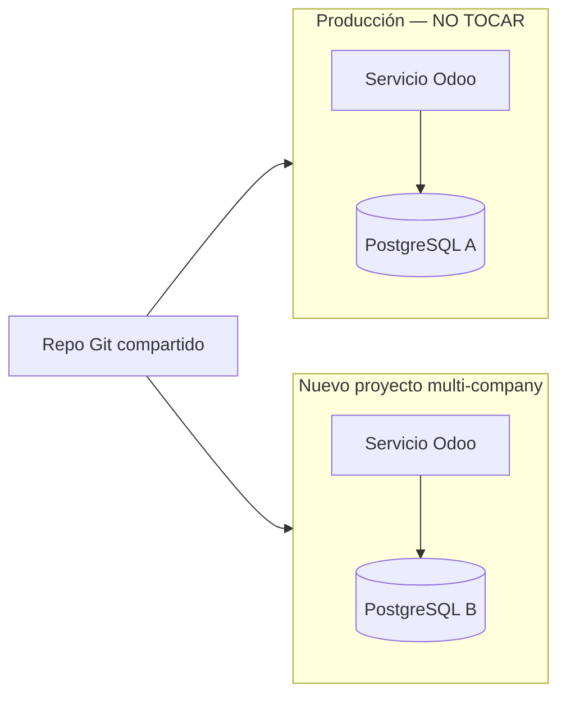

# Despliegue multi-company (sin romper producción single-tenant)

Esta guía explica **qué hacer** para poner en marcha la plataforma multi-company (una BD, varias `res.company`) **sin afectar** la instancia single-tenant que ya tienes en producción.

## Regla de oro

| Instancia | Railway | PostgreSQL | Qué hacer |
|-----------|---------|------------|-----------|
| **Producción actual (single-tenant)** | Proyecto existente | Su propia BD | **No cambiar variables ni dominio.** Sigue igual. |
| **Nueva plataforma (multi-company)** | **Proyecto nuevo** | **Postgres nuevo** | Crear desde cero con las variables de abajo. |

El mismo repositorio Git sirve para ambos. Lo que separa el comportamiento son las **variables de entorno** y el **proyecto Railway**, no el código en sí.



---

## Parte 1 — Proteger la instancia single-tenant (producción)

### Qué NO hacer en el proyecto de producción

No modifiques el proyecto Railway actual ni su Postgres. En concreto:

| Variable / acción | En producción single-tenant |
|-------------------|----------------------------|
| `ODOO_MULTI_TENANT` | **No definir** (o `false`) |
| `ODOO_MULTI_COMPANY_S3` | **No definir** |
| `ODOO_DBFILTER`, `ODOO_TENANT_DOMAIN_MAP`, `ODOO_TENANT_DATABASES` | **No definir** |
| `ODOO_EXTRA_INIT_MODULES` con `company_onboarding` | **No usar** |
| Compartir `DATABASE_URL` con el proyecto nuevo | **No** |
| Mismo dominio para ambos proyectos | **No** |
| Instalar módulo `company_onboarding` en esa BD | **No** (signup público + wizard no aplican ahí) |

### Qué puede seguir igual en producción

Tras hacer merge del código multi-company al repo, la producción single-tenant **sigue funcionando** si mantienes su configuración habitual:

```bash
DATABASE_URL=<tu Postgres de producción>
DB_PASSWORD_ADMIN=<tu secreto actual>
DB_LANGUAGE=es_ES
DB_USERNAME=admin
DB_WITH_DEMO=false
ODOO_LIST_DB=false
ODOO_PROXY_MODE=true
GUNICORN_WORKERS=2
# S3 opcional, sin ODOO_MULTI_COMPANY_S3:
# ODOO_ATTACHMENT_STORAGE=s3
# ORDER_BRIDGE_BANNER_S3_BUCKET=...
```

- Un solo `DATABASE_URL` → una sola BD (como ahora).
- `docker-entrypoint.sh` hace `db init` / `-u base` solo sobre **esa** BD.
- Los cambios en `order_bridge` / `bi_analytics` son compatibles con una sola compañía (no exigen `company_slug` si solo hay una compañía en la BD).

### Checklist rápido — producción intacta

- [ ] No he tocado variables del proyecto Railway de producción.
- [ ] No he enlazado el Postgres de producción al proyecto nuevo.
- [ ] No he puesto `ODOO_MULTI_TENANT` ni `ODOO_MULTI_COMPANY_S3` en producción.
- [ ] Tras un deploy de prueba en producción: `/web/health` → 200 y login normal.

### Dispositivos existentes (single-tenant)

El APK **no necesita** header ni `company_slug` mientras haya **una sola** compañía en la BD. Register, catálogo y pedidos con `device_key` siguen igual (`sudo()` ignora las reglas de compañía).

El riesgo está en el **backend**: Tienda Apk → Dispositivos (filtro «Pendiente de validación»). La `ir.rule` `company_id in company_ids` **oculta** filas con `company_id` vacío. El cliente sigue comprando en la app, pero el admin no puede validar el teléfono.

Al actualizar `order_bridge` a **19.0.1.1.0**, el script [`migrations/19.0.1.1.0/post-migrate.py`](../own_modules/order_bridge/migrations/19.0.1.1.0/post-migrate.py) asigna `base.main_company` a dispositivos (y partners vinculados) sin compañía.

Comprobar **antes** (copia de BD o staging):

```sql
SELECT id, phone, phone_validated, active, company_id
FROM order_bridge_device
WHERE company_id IS NULL;

SELECT id, phone
FROM order_bridge_device
WHERE company_id IS NULL
  AND phone_validated = false
  AND active = true;
```

Tras el deploy (`-u order_bridge` o el entrypoint con `-u base`): esas queries deben devolver **0 filas**.

Checklist post-deploy single-tenant:

- [ ] No instalar `company_onboarding` ni definir `ODOO_MULTI_COMPANY_S3`.
- [ ] 0 dispositivos con `company_id IS NULL`.
- [ ] Tienda Apk → Dispositivos → «Pendiente de validación»: aparecen los mismos que antes.
- [ ] APK: registro / status / pedido sin cambios (sin header).

Plan B (shell Odoo, solo si hay **una** compañía y la migración no corrió):

```python
company = env.ref('base.main_company')
env['order_bridge.device'].sudo().search([('company_id', '=', False)]).write({'company_id': company.id})
```

---

## Parte 2 — Crear el proyecto multi-company (nuevo)

### Paso 1 — Railway

1. [Railway Dashboard](https://railway.com/dashboard) → **New Project**.
2. Añade **PostgreSQL** (nuevo, no el de producción).
3. Añade servicio **Docker** desde este repo (rama que tenga el código multi-company).
4. Enlaza `DATABASE_URL` del Postgres **de este proyecto** al servicio Odoo.
5. Puerto expuesto: **8069**.

### Paso 2 — Variables de entorno (proyecto nuevo)

Copia en Railway **Variables** del servicio Odoo (valores nuevos, no reutilices los de producción):

```bash
# Obligatorias
DATABASE_URL=<referencia al Postgres DE ESTE proyecto>
DB_PASSWORD_ADMIN=<secreto-fuerte NUEVO>
DB_LANGUAGE=es_ES
DB_USERNAME=admin
DB_WITH_DEMO=false

# Modo single-DB multi-company (NO multi-tenant)
ODOO_LIST_DB=false
ODOO_PROXY_MODE=true
GUNICORN_WORKERS=2

# Módulos a instalar en el primer init (y en upgrades si los añades después)
ODOO_EXTRA_INIT_MODULES=order_bridge,bi_analytics,company_onboarding,fs_attachment

# S3 compartido con prefijo por compañía (recomendado)
ODOO_ATTACHMENT_STORAGE=s3
ODOO_MULTI_COMPANY_S3=true
ORDER_BRIDGE_BANNER_S3_BUCKET=<bucket-nuevo-o-dedicado>
ORDER_BRIDGE_BANNER_S3_REGION=us-east-1
ORDER_BRIDGE_BANNER_S3_ACCESS_KEY_ID=...
ORDER_BRIDGE_BANNER_S3_SECRET_ACCESS_KEY=...
```

**Importante:** en este proyecto **no** definas `ODOO_MULTI_TENANT`.

### Paso 3 — Dominio

- Backend: un dominio propio, p. ej. `app.tuplataforma.com` (distinto al de producción).
- Opcional (API móvil por subdominio): wildcard `*.tuplataforma.com` en Railway + DNS.

### Paso 4 — Primer deploy

1. Push a la rama conectada → Railway construye y despliega.
2. El entrypoint:
   - Primera vez: `odoo-bin db init` en la BD vacía.
   - Cada deploy: `odoo-bin -u base` (~2–5 min).
3. Comprueba: `https://<tu-dominio-nuevo>/web/health` → **200**.

### Paso 5 — Verificación funcional

1. Abre `https://<tu-dominio-nuevo>/web/signup` y crea un usuario de prueba.
2. Completa el wizard **Crear mi compañía** (nombre + slug, p. ej. `demo`).
3. Entra al backend: solo debes ver datos de esa compañía.
4. Repite con un segundo usuario/compañía y confirma que no se mezclan datos.
5. API (opcional): `GET /api/order_bridge/products` con header `X-Company-Slug: demo`.

---

## Parte 3 — Comparativa de variables (referencia rápida)

| Variable | Producción single-tenant | Proyecto multi-company |
|----------|--------------------------|------------------------|
| `DATABASE_URL` | Postgres **A** | Postgres **B** (nuevo) |
| `ODOO_MULTI_TENANT` | No | No |
| `ODOO_MULTI_COMPANY_S3` | No | `true` (si usas S3) |
| `ODOO_EXTRA_INIT_MODULES` | No incluir `company_onboarding` | Incluir `company_onboarding` |
| `ODOO_DBFILTER` | No | No |
| Dominio | El actual (p. ej. `tienda.cliente.com`) | Nuevo (p. ej. `app.tuplataforma.com`) |
| Onboarding clientes | Manual / como ahora | Self-service `/web/signup` |

---

## Parte 4 — Operación día a día

### Alta de un nuevo negocio (multi-company)

1. El usuario se registra en `/web/signup`.
2. Completa el wizard (nombre empresa, slug, país, moneda).
3. Opera en el backend con su compañía aislada.
4. Invita empleados asignándoles **solo** esa compañía.

### API Tienda Apk (app móvil)

Cada tienda necesita su `order_bridge_slug` (definido en el wizard o en Ajustes → Compañías):

- Header: `X-Company-Slug: mi-tienda`
- Registro: `POST /api/order_bridge/register` con `"company_slug": "mi-tienda"`
- O subdominio: `mi-tienda.tuplataforma.com` (con wildcard DNS)

### Deploys de código (ambos proyectos)

Cuando hagas push al repo:

- **Producción single-tenant:** redeploy automático; solo corre `-u base` sobre su BD. Sin cambios de variables = sin cambio de modo.
- **Multi-company:** redeploy en su proyecto aparte; su propio `-u base` sobre su BD.

No hace falta desplegar ambos a la vez; son proyectos independientes.

---

## Parte 5 — Errores frecuentes (y cómo evitarlos)

| Error | Causa | Solución |
|-------|--------|----------|
| Producción pide `company_slug` en la API | Hay **varias** `res.company` en la BD de producción | En producción debe haber **una** compañía; no uses el proyecto multi-company en esa BD |
| Signup público en producción | Instalado `company_onboarding` o `auth_signup.invitation_scope=b2c` | No instales `company_onboarding` en producción |
| Datos mezclados entre clientes | Mismo proyecto/BD para ambos modos | Proyecto y Postgres **separados** |
| S3 sobrescribe archivos | Mismo bucket sin prefijo en multi-company | `ODOO_MULTI_COMPANY_S3=true` en el proyecto nuevo |
| `/tenant/provision` activo | `ODOO_MULTI_TENANT=true` | No usar en multi-company; es otro modo (varias BD) |

---

## Parte 6 — Documentación relacionada

| Documento | Contenido |
|-----------|-----------|
| [RAILWAY_MULTI_COMPANY_CHECKLIST.md](RAILWAY_MULTI_COMPANY_CHECKLIST.md) | Checklist técnico multi-company |
| [RAILWAY.md](RAILWAY.md) | Despliegue general en Railway |
| [RAILWAY_MULTI_TENANT_CHECKLIST.md](RAILWAY_MULTI_TENANT_CHECKLIST.md) | Modo alternativo: **varias BD** (no es este despliegue) |
| [.env.example](../.env.example) | Plantilla de variables |

---

## Resumen en una frase

**Deja producción como está** (mismo proyecto Railway, mismo Postgres, sin `ODOO_MULTI_TENANT` ni `company_onboarding`); **crea un proyecto Railway nuevo** con Postgres nuevo, dominio nuevo y las variables de la Parte 2 para la plataforma multi-company.
