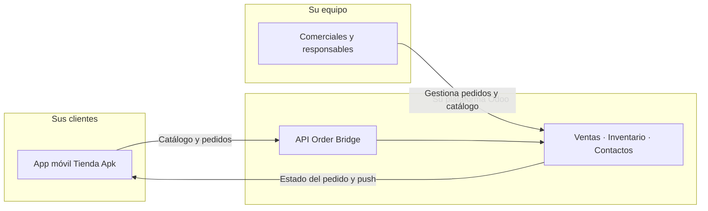

# Tienda Apk — Guía para su negocio

Documento orientado a **empresas B2B** que quieren vender con una tienda móvil conectada a Odoo. Resume qué incluye el producto, cómo funciona el día a día y qué debe configurar su equipo en el backend.

Para detalle técnico de la API, consulte la documentación interna del módulo en `own_modules/order_bridge/docs/`.

---

## Qué es Tienda Apk

**Tienda Apk** (módulo `order_bridge` en Odoo) es la plataforma que conecta su catálogo y pedidos de Odoo con una **aplicación móvil** para sus clientes finales.

| Capa | Quién la usa | Para qué |
|------|--------------|----------|
| **App móvil** | Sus compradores | Ver productos, hacer pedidos, seguir el estado y recibir avisos |
| **Odoo (backend)** | Su equipo comercial | Catálogo, inventario, pedidos, validación de clientes y operación diaria |
| **API REST** | App e integraciones | Sincroniza catálogo, perfil, pedidos y notificaciones |

Los compradores **no necesitan usuario de Odoo**. Se identifican con su teléfono y una clave de dispositivo generada por la app. Su personal gestiona todo desde Odoo, en el menú **Ventas → Tienda Apk**.

---

## Qué obtiene su negocio

- **Canal de venta móvil** alineado con su catálogo real en Odoo (precios, stock y promociones).
- **Pedidos centralizados** en Odoo, con el mismo flujo de ventas, inventario y facturación que ya conoce.
- **Control de clientes** mediante validación de dispositivos por teléfono.
- **Seguimiento del pedido** con estados pensados para entrega y negociación (revisando → negociando → listo → entregado).
- **Avisos al cliente** por notificación push cuando cambia el estado del pedido (con Firebase configurado).
- **Contenido promocional** con banners editables desde Odoo.
- **Zona de cobertura** configurable con municipios y barrios para direcciones de entrega.
- **Alertas internas** opcionales por Telegram cuando entra un pedido nuevo.

---

## Cómo funciona (visión general)

**Flujo típico:**

1. El cliente descarga la app y se registra con su **teléfono** (8 dígitos).
2. La app genera una **clave de dispositivo** y queda registrada en Odoo.
3. Su equipo puede **validar el teléfono** cuando confíe en ese cliente (recomendado antes de entregas sensibles).
4. El cliente navega el **catálogo**, completa su **perfil y dirección** y realiza el **pedido**.
5. El pedido aparece en Odoo, se **confirma automáticamente** y reserva stock según su configuración.
6. Su equipo avanza el **estado tienda**; la app refleja el cambio y puede enviar una **notificación push**.
7. Opcionalmente, su equipo recibe un **mensaje en Telegram** al crear el pedido.

---

## Requisitos previos

Para operar Tienda Apk en Odoo necesita, como mínimo:

| Requisito | Detalle |
|-----------|---------|
| **Odoo 19** con el módulo **Tienda Apk** instalado | Incluye Ventas, Inventario (para stock), validación de teléfono y programas de fidelización |
| **Almacén** configurado en su compañía | Obligatorio para crear pedidos desde la app |
| **Productos** dados de alta en Odoo | Con precio, imagen y opción de venta activada |
| **App móvil** | Cliente Capacitor conectada a su instancia Odoo (la proporcionamos como parte del producto) |
| **Acceso HTTPS** a su Odoo | La app y las notificaciones push requieren URL pública segura |

Opcional pero recomendable:

- **Firebase** (cuenta de servicio) para notificaciones push.
- **Telegram** (bot + chat) para avisos internos de pedidos nuevos.
- **Almacenamiento S3** para imágenes de productos y banners (según despliegue).

---

## Primeros pasos en Odoo

Tras la instalación, el menú principal está en **Ventas → Tienda Apk**:

| Menú | Uso |
|------|-----|
| **Datos generales** | Teléfono de contacto de la tienda (visible en la app vía API) |
| **Banners publicitarios** | Carrusel promocional en la app |
| **Municipios / Barrios** | Zona de entrega para direcciones de clientes |
| **Dispositivos** | Registro y validación de teléfonos de la app |
| **Pedidos Tienda Apk** | Listado filtrado de pedidos del canal móvil |
| **Clientes Tienda Apk** | Contactos registrados desde la app |
| **Enviar notificación push** | Campañas o avisos puntuales a clientes o a todos |

### Datos generales

En **Ventas → Tienda Apk → Datos generales** indique el **teléfono de la tienda** (por ejemplo, atención al cliente o WhatsApp comercial). La app lo consulta con `GET /api/order_bridge/settings`.

### Municipios y barrios

Defina las **zonas donde entrega** antes de que los clientes completen su perfil:

1. Cree los **municipios** activos.
2. Dentro de cada municipio, cree los **barrios** correspondientes.
3. La app lista los municipios con `GET /api/order_bridge/municipalities`; el perfil del cliente usa los **IDs** de municipio y barrio.

Si un municipio o barrio ya está en uso en direcciones de clientes, Odoo no permitirá borrarlo hasta liberar esas referencias.

---

## Catálogo de productos

Solo aparecen en la app los productos que cumplan **todas** estas condiciones:

- Producto **activo** y marcado como **Se puede vender**.
- Casilla **Visible en Tienda Apk** activada en la ficha del producto (plantilla).
- Pertenecen a su **compañía** (o son compartidos sin compañía, según su configuración).
- Si el producto **rastrea inventario**, debe haber **stock disponible** en el almacén; si no hay unidades libres, no se muestra en el listado.

### Inventario y descuento de stock

Para productos físicos que deben descontar existencias:

| Configuración en el producto | Efecto |
|------------------------------|--------|
| Tipo **Bienes** | Producto almacenable |
| **Rastrear inventario** activado | Exige stock libre; genera reservas y movimientos |
| Almacén de la compañía | Necesario para confirmar pedidos API |

Los pedidos creados desde la app se **confirman solos**. La cantidad libre se reserva al confirmar; la cantidad física baja cuando valida la **entrega** (albarán en estado hecho), igual que en Odoo estándar.

Los **servicios** y los bienes **sin** rastreo de inventario no exigen stock ni mueven existencias físicas.

### Categorías

La app agrupa productos por las **categorías internas de producto** de Odoo (`product.category`). Mantenga un árbol de categorías claro para facilitar la navegación en móvil.

---

## Banners publicitarios

En **Ventas → Tienda Apk → Banners publicitarios** puede crear piezas para la home de la app:

- **Título**, subtítulo, colores de fondo y texto.
- **Imagen** (recomendada para impacto visual).
- **Enlace** opcional (`href`) a una URL o deep link.
- **Secuencia** para ordenar el carrusel.
- **Activo** para publicar u ocultar sin borrar.

Solo se sirven banners **activos** de la compañía del catálogo. La app los obtiene con `GET /api/order_bridge/banners`.

---

## Clientes y dispositivos

### Registro desde la app

Cuando un cliente abre la app por primera vez:

1. Introduce su **teléfono** (8 dígitos).
2. La app genera una **clave de dispositivo** única y llama a `POST /api/order_bridge/register`.
3. Odoo crea o enlaza un **contacto** (`res.partner`) y un registro de **dispositivo**.

### Validación (recomendada)

En **Ventas → Tienda Apk → Dispositivos** (filtro por defecto: *Pendiente de validación*):

- Revise teléfono, contacto y última actividad.
- Pulse **Validar teléfono** cuando confíe en ese cliente.

**Importante:**

- Los pedidos **pueden crearse antes** de validar; el pedido indica si el dispositivo estaba validado en el momento de la compra.
- **Un teléfono, un dispositivo activo**: si el cliente instala la app en otro móvil, el dispositivo anterior se desactiva y el nuevo vuelve a quedar pendiente de validación.
- Puede **revocar** la validación si detecta un uso indebido.

También puede gestionar dispositivos desde la pestaña **Tienda Apk** en la ficha del contacto.

### Perfil y dirección de entrega

El cliente completa nombre y dirección desde la app (`GET` / `PUT` / `PATCH /api/order_bridge/profile`):

- Calle o referencia.
- **Municipio** y **barrio** (IDs configurados en Odoo).
- Provincia o estado.

Odoo guarda una **instantánea de la dirección** en cada pedido, de modo que un cambio posterior del perfil no altera pedidos ya realizados.

---

## Gestión de pedidos

### Dónde verlos

- **Ventas → Tienda Apk → Pedidos Tienda Apk** — vista dedicada al canal.
- **Ventas → Pedidos** — mismos registros, con campos adicionales de Tienda Apk en el formulario.

Cada pedido del canal incluye:

- **Referencia Tienda Apk** (p. ej. `OB-00042`).
- **Origen**: app o administrador.
- **Dispositivo** vinculado y si estaba validado.
- **Estado tienda** (flujo propio del canal móvil).
- **Código promocional** aplicado, si lo hubo.

### Estados tienda

Flujo pensado para negocios con **confirmación, negociación y entrega**:

| Estado | Significado | Acciones habituales |
|--------|-------------|---------------------|
| **Revisando** | Pedido recién recibido | Revisar líneas, stock y datos de entrega |
| **Negociando** | En conversación con el cliente | Ajustar cantidades, precios o disponibilidad fuera de la app |
| **Listo para entrega** | Preparado para salir | Coordinar reparto o recogida |
| **Entregado** | Completado | Cerrar operación; validar albarán en inventario si aplica |
| **Cancelado** | Anulado en el canal | Informar al cliente |

En el formulario del pedido use los botones del encabezado (**Negociar**, **Listo para la entrega**, **Entregado**, **Cancelar**). Las transiciones siguen reglas de negocio (no se puede saltar estados arbitrariamente).

Cuando cambia el **estado tienda**, la app puede recibir una **notificación push** automática al cliente (si tiene token FCM registrado).

### Pedidos creados por su equipo

También puede registrar ventas del canal desde Odoo (origen **administrador**), por ejemplo por teléfono o mostrador, manteniendo el mismo flujo de estados tienda. Esas órdenes aparecen en el historial del cliente en la app si comparten el mismo contacto.

### Cancelación desde la app

El cliente puede cancelar un pedido desde la app **solo mientras esté en borrador** (`POST /api/order_bridge/orders/<id>/cancel`). Una vez confirmado en Odoo, la cancelación se gestiona desde el backend con el flujo habitual de ventas y el estado tienda.

---

## Promociones y cupones

Tienda Apk acepta un código opcional `promo_code` al crear el pedido. Se apoya en **Ventas → Productos → Descuentos y fidelización** de Odoo.

Casos habituales para campañas móviles:

| Tipo en Odoo | Ejemplo | Uso en la app |
|--------------|---------|---------------|
| **Código de descuento** | `VERANO10` | El cliente lo escribe al pagar |
| **Cupones** | Códigos únicos generados | Campañas puntuales |
| **Promociones automáticas** | Descuento si supera un importe | Se aplican sin código si el carrito cumple la regla |

Configure el programa, pruébelo en un pedido de prueba en Odoo y luego verifique el mismo código desde la app. Si el código no es válido, la API responde con error y **no crea** el pedido.

Guía detallada: `own_modules/order_bridge/docs/LOYALTY_COUPONS.md`.

---

## Notificaciones push (opcional)

Permite avisar al cliente cuando cambia el estado de su pedido o enviar **campañas** (ofertas, novedades).

**Qué necesita:**

1. Proyecto **Firebase** con apps Android e iOS configuradas.
2. Cuenta de servicio JSON montada en el servidor Odoo (`ORDER_BRIDGE_FCM_SERVICE_ACCOUNT_PATH` o variable JSON equivalente).
3. Clientes con la app instalada y token FCM registrado.

**Envío desde Odoo:**

- Automático al cambiar **estado tienda**.
- Manual: **Ventas → Tienda Apk → Enviar notificación push** (un contacto, varios o difusión global).

Detalle técnico: `own_modules/order_bridge/docs/FCM_PUSH.md`.

---

## Alertas Telegram para su equipo (opcional)

Si configura `TELEGRAM_BOT_TOKEN` y `TELEGRAM_CHAT_ID` en el servidor, Odoo envía un mensaje al **chat de su equipo** cada vez que entra un **pedido nuevo desde la app**, con referencia, cliente, dirección y líneas.

Útil para negocios que quieren reaccionar al instante sin estar pendientes del backend.

---

## Roles y permisos

En **Ajustes → Usuarios** asigne los grupos de Tienda Apk:

| Grupo | Perfil típico | Permisos destacados |
|-------|---------------|---------------------|
| **Usuario Tienda Apk** | Comercial, atención al cliente | Dispositivos, pedidos, banners, municipios, push |
| **Responsable Tienda Apk** | Jefe de tienda / administrador | Todo lo anterior + **Datos generales** y permisos de responsable de ventas |

Ambos grupos incluyen acceso de **vendedor** de Odoo para operar pedidos y contactos.

---

## Operación diaria recomendada

Checklist para el equipo comercial:

1. **Mañana:** revisar **Dispositivos** pendientes de validación.
2. **Catálogo:** comprobar stock y productos con **Visible en Tienda Apk**; desactivar los agotados o marcar no visibles.
3. **Pedidos:** atender la cola en **Revisando**; avanzar estados y preparar entregas.
4. **Contenido:** actualizar **banners** si hay promociones de la semana.
5. **Promociones:** activar o caducar códigos en **Descuentos y fidelización**.
6. **Cierre:** validar albaranes de entrega en Inventario para reflejar salidas reales de stock.

---

## Qué incluye el producto y qué aporta su negocio

| Incluido en la plataforma Tienda Apk | Responsabilidad de su negocio |
|--------------------------------------|-------------------------------|
| Módulo Odoo **Tienda Apk** y API REST | Catálogo, precios e imágenes de productos |
| Integración con ventas, stock y fidelización | Almacén, proveedores y reposición |
| App móvil para sus clientes finales | Marca, política comercial y atención al cliente |
| Flujo de estados tienda y pedidos en Odoo | Validación de clientes y gestión de entregas |
| Soporte a push y Telegram (según despliegue) | Contenido de campañas y canal Telegram interno |
| Documentación OpenAPI del contrato API | Equipo que opera Odoo día a día |

---

## Preguntas frecuentes

**¿Puede un cliente comprar sin que validemos su teléfono?**  
Sí. La validación es una capa de confianza y control operativo; el pedido queda marcado para que sepa si el dispositivo estaba validado.

**¿Se duplican pedidos si la app reintenta por mala conexión?**  
No, si la app reutiliza el mismo `client_order_id` (UUID por checkout). El backend devuelve el pedido existente.

**¿Los precios los cambio solo en Odoo?**  
Sí. La app lee el catálogo en tiempo real desde Odoo.

**¿Puedo vender servicios sin stock?**  
Sí. Configure el producto como **Servicio** o como **Bienes** sin **Rastrear inventario**.

**¿Dónde está la documentación técnica de la API?**  
Especificación OpenAPI: `GET /order_bridge/static/openapi.json` en su instancia, o el fichero `own_modules/order_bridge/docs/openapi.json`. Ejemplos: `own_modules/order_bridge/docs/API_EXAMPLES.md`.

---

## Siguiente paso

Para **contratar o activar** Tienda Apk en su instancia, contacte con su proveedor. Para **formación del equipo**, use este documento junto con una sesión práctica sobre: catálogo, dispositivos, primer pedido de prueba y flujo de estados hasta entrega.

*Documento alineado con el módulo `order_bridge` (Tienda Apk) en Odoo 19.*
