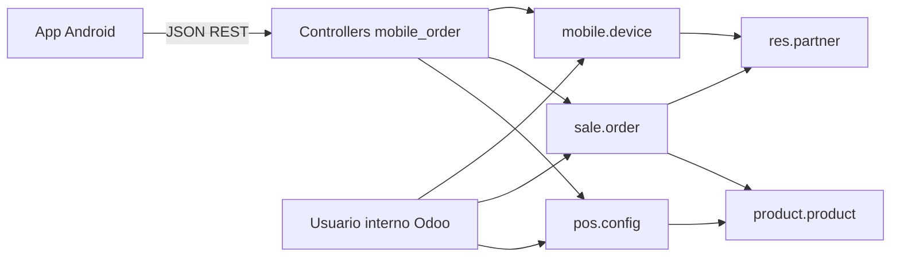

# mobile_order — Arquitectura y decisiones de diseño

Documento de referencia para el módulo **Puente móvil para pedidos** (`mobile_order`) en Odoo 19. Resume el alcance, la arquitectura, los módulos reutilizados y las decisiones tomadas.

## Objetivo

Exponer una **API REST JSON** para una aplicación Android que actúa como punto de venta: los clientes se identifican por **teléfono**, el **dispositivo** queda registrado con una clave única generada en la app, y un **administrador de la tienda** valida el teléfono (y por tanto el dispositivo activo). Las órdenes se almacenan en Odoo; debe quedar claro qué pedidos provienen de **dispositivos aún no validados**.

## Módulos Odoo reutilizados (Community)

| Módulo | Uso |
|--------|-----|
| **sale** | `sale.order` / `sale.order.line`, estados `draft` → `sent` → `sale` → `cancel`. |
| **product** | Catálogo (`product.product`), precios, venta (`sale_ok`). |
| **point_of_sale** | `pos.config`, `pos.category`, y la misma lógica de dominio que el TPV (`product.template._load_pos_data_domain`) para alinear el catálogo móvil con un punto de venta concreto. |
| **contacts** (base) | `res.partner` y campo `phone`. |
| **phone_validation** | Normalización de números vía `phone_format` (E.164 cuando es posible). |

Opcionales a futuro: **sale_management** (plantillas), **rpc** solo como referencia de patrones HTTP/JSON en core (este módulo no usa `/json/2`).

### Catálogo móvil y TPV

- En **`res.company`** el campo **`mobile_pos_config_id`** enlaza **un único** `pos.config` por compañía con la APK.
- Configuración: **Ajustes → Punto de venta** (bloque «Mobile app») o pestaña **Mobile app** en el formulario de la compañía.
- Si no hay configuración enlazada, las rutas de catálogo y la creación de pedidos desde la app responden **503** con `error: configuration`.
- Los productos expuestos cumplen el mismo dominio que el POS: compañía del TPV, `available_in_pos`, `sale_ok`, y si el TPV tiene **Restringir categorías**, filtro por `pos_categ_ids` como en Odoo estándar.
- Filtros opcionales en listado: `category_id` (categoría interna de producto), `pos_category_id` (categoría POS, `child_of`).

## Principios de diseño

1. **Sin usuarios Odoo para clientes móviles**  
   No portal ni `res.users` por cliente. Identidad = `device_key` + vínculo a `res.partner`.

2. **Lo que se valida es el dispositivo ligado al teléfono**  
   El usuario introduce el teléfono en la APK; la app genera y guarda un `device_key` (p. ej. UUID v4). El backend registra `phone` + `device_key`. Tras la validación administrativa, ese dispositivo se considera validado.

3. **Un teléfono, un dispositivo activo**  
   Si se registra un nuevo `device_key` para el mismo teléfono normalizado, los dispositivos anteriores con ese teléfono se **desactivan**. El nuevo queda pendiente de validación de nuevo (**re-validación** por seguridad).

4. **Pedidos antes de validar**  
   La API **permite crear pedidos** con dispositivo no validado; en `sale.order` queda almacenado si el dispositivo estaba validado o no (`mobile_device_validated`), para informes y filtros en backend.

5. **Órdenes creadas por administrador**  
   Origen `mobile_origin = 'admin'`, sin `mobile_device_id`. Visibles en la app junto a las del usuario (`partner_id` común), con referencia móvil cuando aplica.

6. **API stateless orientada a JSON**  
   Respuestas JSON planas (`make_json_response`), rutas `auth='public'`, `csrf=False`, y autorización por cabecera `Authorization: Bearer <device_key>` resuelta en código (no confundir con API keys de `res.users`).

## Modelos de datos

### `mobile.device`

Registro por dispositivo: `device_key` (único), `partner_id`, `phone` (normalizado), `phone_validated`, `active`, fechas de registro y última actividad, `device_info` opcional.

### Extensiones

- **`res.company`**: `mobile_pos_config_id` → `pos.config` usado por la API móvil para esa compañía.
- **`res.partner`**: relación a dispositivos; campos calculados almacenados `mobile_app_registered`, `mobile_phone_validated`; contador de pedidos móviles (no almacenado).
- **`sale.order`**: `mobile_origin` (`app` | `admin`), `mobile_device_id`, `mobile_device_validated` (snapshot al crear), `mobile_order_ref` (secuencia tipo `MO-00001`), `mobile_pos_config_id` (TPV aplicable al crear desde la app).

## API REST (prefijo `/api/mobile/`)

| Método | Ruta | Auth |
|--------|------|------|
| POST | `/register` | Ninguna (body JSON) |
| OPTIONS | `/*` | CORS preflight |
| GET | `/status` | Bearer `device_key` |
| GET | `/categories` | Bearer |
| GET | `/products`, `/products/<id>` | Bearer |
| POST | `/orders` | Bearer |
| GET | `/orders`, `/orders/<id>` | Bearer |
| POST | `/orders/<id>/cancel` | Bearer |
| GET | `/profile` | Bearer |

Listados: paginación `limit` / `offset` donde aplica.

## Autenticación en código (`@mobile_auth`)

1. Lee `Authorization: Bearer <token>`.
2. Busca `mobile.device` activo con ese `device_key`.
3. Si no existe → 401.
4. **No** bloquea si `phone_validated` es falso (solo afecta a flags en pedidos).
5. Actualiza `last_activity` en el dispositivo.
6. Inyecta dispositivo y partner en el controlador (vía `sudo()` acotado a datos del dispositivo).

## Seguridad operativa

- Tras validar el dispositivo, todas las operaciones quedan acotadas al `partner_id` del dispositivo (no se acepta `partner_id` arbitrario del cliente).
- `device_key` aleatorio de alta entropía; almacenado en claro en BD (similar al prefijo de API keys de Odoo: secreto largo no elegido por el usuario).
- Registro idempotente: mismo `device_key` devuelve estado actual sin duplicar filas.

## Consideraciones técnicas

- **CORS**: cabeceras en respuestas y manejo `OPTIONS` para clientes HTTP no navegador / herramientas de prueba.
- **Cron**: desactivar dispositivos sin actividad tras N días (parámetro de sistema).
- **Administración**: menús y acciones para listar dispositivos, validar/revocar, filtrar pedidos móviles por origen y por “dispositivo no validado”.

## Diagrama de componentes (resumen)

## Flujos resumidos

1. **Alta**: App genera `device_key` → POST `/register` con `phone`, `name`, `device_key` → partner + device; admin valida en backend → GET `/status` refleja `validated`.
2. **Pedido**: POST `/orders` con líneas; se crea `sale.order` con `mobile_origin=app` y snapshot de validación del dispositivo.
3. **Cambio de móvil**: nuevo `device_key` + mismo teléfono → dispositivos previos con ese teléfono inactivos → nuevo pendiente de validación.

---

## Documentación adicional

- [Ejemplos curl / pruebas manuales](API_EXAMPLES.md)

---

*Última alineación con el plan funcional acordado para el proyecto.*
