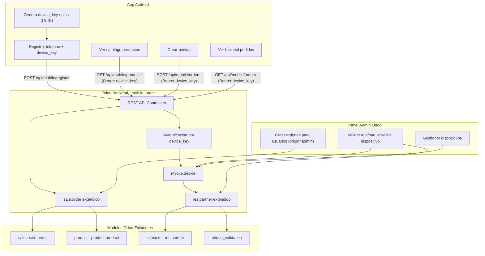
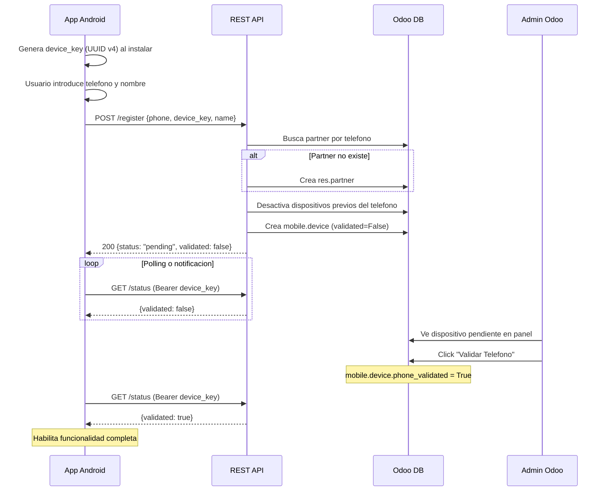
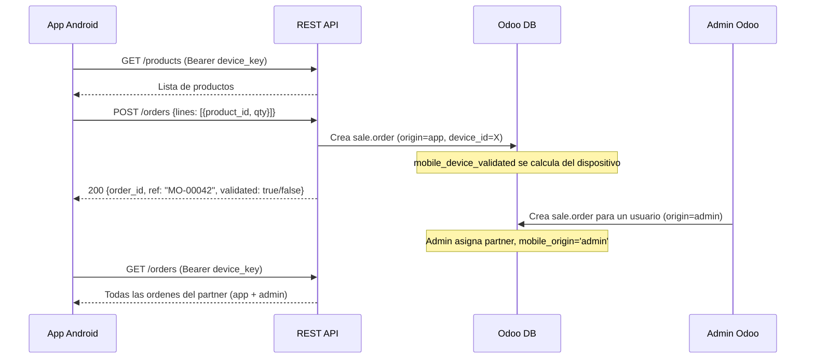
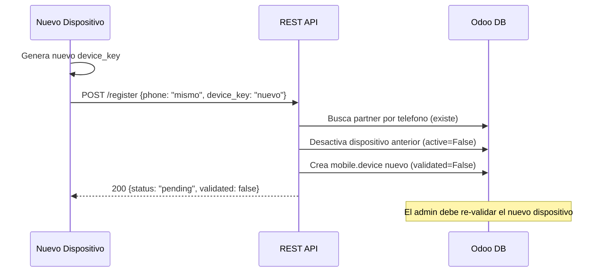

# Plan: Modulo Puente Movil para Pedidos (mobile_order)

## Objetivo

Crear un modulo custom de Odoo 19 llamado `mobile_order` que sirva de puente REST API entre una aplicacion Android y el backend de Odoo. La app movil actuara como punto de venta donde los clientes hacen pedidos de compra, identificados por telefono y validados por un administrador.

---

## Modulos gratuitos de Odoo 19 a reutilizar

- `**sale**` — Motor de ordenes de venta (`sale.order`, `sale.order.line`). Ya tiene estados: `draft` -> `sent` -> `sale` -> `cancel`. Se extiende en lugar de reinventar.
- `**product**` — Catalogo de productos (`product.template`, `product.product`). Precios, variantes, categorias, UoM.
- `**contacts**` (base) — Gestion de contactos (`res.partner`). Ya tiene campo `phone`. Sirve como registro de usuarios moviles.
- `**phone_validation**` — Sanitizacion y validacion de numeros de telefono. Normaliza formatos.
- `**sale_management**` (opcional) — Plantillas de cotizacion si se quieren pre-configurar pedidos tipo.
- `**rpc**` — Referencia de patrones para el dispatcher `json2` y autenticacion `bearer`. Se usara como inspiracion, pero nuestros endpoints seran custom.

---

## Arquitectura propuesta

### Diagrama de flujo general




### Autenticacion: Device Key (no portal users, no login)

Los usuarios moviles **no son usuarios de Odoo**. La autenticacion se basa en un **device key unico generado por la app Android** (UUID v4 o similar). No hay paso de "login" separado.

**Flujo:**

1. La app genera un `device_key` unico al instalarse (persistido localmente en el dispositivo)
2. El usuario introduce su telefono en la app
3. La app llama a `POST /api/mobile/register` con `{phone, device_key, name}`
4. El backend crea un `res.partner` (si no existe para ese telefono) y un registro `mobile.device` vinculando el `device_key` al partner
5. Si ya existia un dispositivo anterior para ese telefono, se **desactiva** (un telefono = un dispositivo activo)
6. El admin ve el dispositivo pendiente en el panel y **valida el telefono** -> el dispositivo queda validado
7. A partir de ese momento, todas las peticiones desde la app llevan `Authorization: Bearer <device_key>`

**Reglas clave:**

- Un telefono solo puede tener **un dispositivo activo** a la vez (el nuevo desplaza al anterior)
- Dispositivos no validados **pueden hacer pedidos**, pero estos quedan marcados como `device_validated = False`
- Validar el telefono en el admin valida automaticamente el dispositivo activo asociado
- No se crean cuentas de usuario Odoo: ligero, seguro, desacoplado

---

## Modelos a crear/extender

### 1. Modelo `mobile.device` (nuevo)

El modelo central de autenticacion. Cada registro vincula un dispositivo fisico con un contacto (partner).

```python
class MobileDevice(models.Model):
    _name = 'mobile.device'
    _description = 'Dispositivo Movil Registrado'

    device_key = fields.Char(required=True, index=True, readonly=True)
    partner_id = fields.Many2one('res.partner', required=True, ondelete='cascade')
    phone = fields.Char(required=True, index=True)
    phone_validated = fields.Boolean(default=False)
    active = fields.Boolean(default=True)
    registration_date = fields.Datetime(default=fields.Datetime.now)
    last_activity = fields.Datetime()
    device_info = fields.Char(help='User-Agent o info del dispositivo Android')

    _sql_constraints = [
        ('device_key_unique', 'UNIQUE(device_key)', 'El device key debe ser unico'),
    ]
```

**Logica clave:**

- Al registrar un nuevo dispositivo para un telefono existente, se desactivan los dispositivos anteriores (`active = False`)
- `phone_validated` lo cambia el admin; al hacerlo, el dispositivo puede operar con privilegio completo
- `last_activity` se actualiza en cada request para monitoreo

### 2. Extension de `res.partner`

```python
class ResPartner(models.Model):
    _inherit = 'res.partner'

    mobile_device_ids = fields.One2many('mobile.device', 'partner_id')
    mobile_app_registered = fields.Boolean(compute='_compute_mobile_app', store=True)
    mobile_phone_validated = fields.Boolean(compute='_compute_mobile_app', store=True)
    mobile_order_count = fields.Integer(compute='_compute_mobile_order_count')
```

- `mobile_app_registered`: True si tiene al menos un `mobile.device` activo
- `mobile_phone_validated`: True si su dispositivo activo esta validado
- Computed y stored para permitir filtros eficientes en vistas tree

### 3. Extension de `sale.order`

```python
class SaleOrder(models.Model):
    _inherit = 'sale.order'

    mobile_origin = fields.Selection([
        ('app', 'App Movil'),
        ('admin', 'Administrador'),
    ], string='Origen Movil')
    mobile_device_id = fields.Many2one('mobile.device')
    mobile_device_validated = fields.Boolean(
        related='mobile_device_id.phone_validated',
        store=True, string='Dispositivo Validado')
    mobile_order_ref = fields.Char(string='Referencia Movil', index=True)
```

- `mobile_origin = 'app'`: creado desde la app Android
- `mobile_origin = 'admin'`: creado por un administrador en el backend para ese usuario
- `mobile_device_validated`: campo related que refleja si el dispositivo estaba validado. **Se almacena (store=True)** para poder filtrar ordenes de dispositivos no validados
- `mobile_order_ref`: referencia legible para el usuario (ej: `MO-00001`)

---

## Endpoints REST API

Todos bajo el prefijo `/api/mobile/`. El `device_key` se envia como `Authorization: Bearer <device_key>` en todos los endpoints excepto `/register`.

**Registro (sin auth):**

- `POST /api/mobile/register` — Registra dispositivo. Body: `{phone, device_key, name, device_info?}`. Crea partner + device. Si el telefono ya existe, vincula al partner existente y desactiva dispositivos anteriores. Retorna `{status, partner_id, validated}`.

**Consulta de estado (con device_key):**

- `GET /api/mobile/status` — Retorna estado actual del dispositivo: `{validated, phone, partner_name}`. La app usa esto para saber si el admin ya valido el telefono.

**Catalogo (con device_key, no requiere validacion):**

- `GET /api/mobile/products` — Lista de productos disponibles. Soporta `?limit=&offset=&category_id=`. Funciona aunque el dispositivo no este validado (el catalogo es publico).
- `GET /api/mobile/products/<int:product_id>` — Detalle de un producto.

**Ordenes (con device_key):**

- `POST /api/mobile/orders` — Crear pedido. Body: `{lines: [{product_id, qty}]}`. Funciona sin validacion, pero el pedido queda con `mobile_device_validated = False`.
- `GET /api/mobile/orders` — Lista pedidos del usuario (tanto `origin=app` como `origin=admin`). Soporta `?limit=&offset=&state=`.
- `GET /api/mobile/orders/<int:order_id>` — Detalle de un pedido.
- `POST /api/mobile/orders/<int:order_id>/cancel` — Cancelar pedido (solo si esta en `draft`).

**Perfil (con device_key):**

- `GET /api/mobile/profile` — Datos del contacto asociado al dispositivo.

---

## Estructura del modulo

```
addons/mobile_order/
  __init__.py
  __manifest__.py
  docs/
    ARCHITECTURE.md         # Documento completo de arquitectura y decisiones
  models/
    __init__.py
    mobile_device.py        # Modelo mobile.device
    res_partner.py          # Extension de res.partner
    sale_order.py           # Extension de sale.order
  controllers/
    __init__.py
    main.py                 # Endpoints REST API
    decorators.py           # Decorator @mobile_auth para validar device_key
  security/
    ir.model.access.csv     # Permisos de acceso
    mobile_order_security.xml  # Grupos y reglas de registro
  views/
    mobile_device_views.xml # Vistas del modelo mobile.device
    res_partner_views.xml   # Tab "App Movil" en formulario de contacto
    sale_order_views.xml    # Campos mobile en formulario de orden
    mobile_menu.xml         # Menu principal y acciones
  data/
    mobile_order_data.xml   # Secuencias, cron de limpieza
  i18n/
    es.po                   # Traducciones espanol
```

---

## Vistas de administrador en Odoo

1. **Menu principal "Pedidos Moviles"** con submenus:
  - **Dispositivos** — Vista tree/form de `mobile.device`. Columnas: telefono, partner, validado, fecha registro, ultima actividad. Filtros: "Pendientes de validacion", "Validados", "Inactivos". Boton de accion "Validar Telefono" / "Revocar Validacion"
  - **Ordenes Moviles** — Vista tree de `sale.order` con `mobile_origin != False`. Filtros: por origen (app/admin), por estado, por validacion del dispositivo. Etiqueta visual diferenciando ordenes de dispositivos no validados
  - **Usuarios Moviles** — Vista tree de `res.partner` con `mobile_app_registered = True`. Accion rapida para validar/invalidar
2. **Formulario de contacto extendido** — Tab "App Movil" que muestra:
  - Estado de validacion (badge)
  - Dispositivo activo actual (device_key parcial, fecha registro, info)
  - Historial de dispositivos anteriores (inactivos)
  - Contador de ordenes moviles con smart button
3. **Formulario de orden de venta extendido** — Grupo "Informacion Movil" con: origen, referencia movil, dispositivo, estado de validacion

---

## Flujos de uso

### Flujo 1: Registro y validacion de dispositivo



### Flujo 2: Pedidos (validado y no validado)



### Flujo 3: Cambio de dispositivo




---

## Consideraciones tecnicas

- **Formato de respuesta:** JSON plano (no JSON-RPC). Usar `request.make_json_response()` de Odoo 19 con `type='http'` y `auth='none'` en los controllers.
- **CORS:** Habilitar headers CORS en los controllers para que la app Android pueda consumir la API. Se implementa sobrescribiendo el metodo `_serve_fallback` o anadiendo headers en cada respuesta.
- **Decorator `@mobile_auth`:** Un decorator en `controllers/decorators.py` que:
  1. Lee `Authorization: Bearer <device_key>` del header
  2. Busca `mobile.device` activo con ese `device_key`
  3. Inyecta el `device` y `partner` en los kwargs del controller
  4. Retorna 401 si el device_key no existe o esta inactivo
  5. **No** bloquea si el dispositivo no esta validado (eso se marca en la orden)
- **Paginacion:** Endpoints de listado soportan `?limit=&offset=` como query params.
- **Sanitizacion de telefono:** Usar `phone_validation` para normalizar numeros antes de buscar/crear partners.
- **Seguridad del device_key:** El `device_key` es un UUID v4 generado por la app (128 bits de entropia). Se almacena hasheado en la BD? No necesariamente — a diferencia de passwords, el device_key no se "elige" por el usuario sino que es aleatorio. Se puede almacenar en texto plano con un indice unico, similar a como Odoo almacena el prefijo de sus API keys.
- **Idempotencia:** Si la app llama a `/register` con un `device_key` que ya existe, retorna el estado actual sin crear duplicados.
- **Cron de limpieza:** Job programado que desactiva dispositivos sin actividad en X dias (configurable).
- **Re-validacion:** Cuando un usuario cambia de dispositivo, el nuevo dispositivo debe ser re-validado por el admin. Esto es una decision de seguridad (evita que alguien con el telefono de otro registre el numero en su dispositivo).
- **Ordenes de dispositivos no validados:** Se registran normalmente como `sale.order` pero con `mobile_device_validated = False`. El admin puede filtrar y ver estas ordenes por separado. Puede decidir procesarlas o no.

