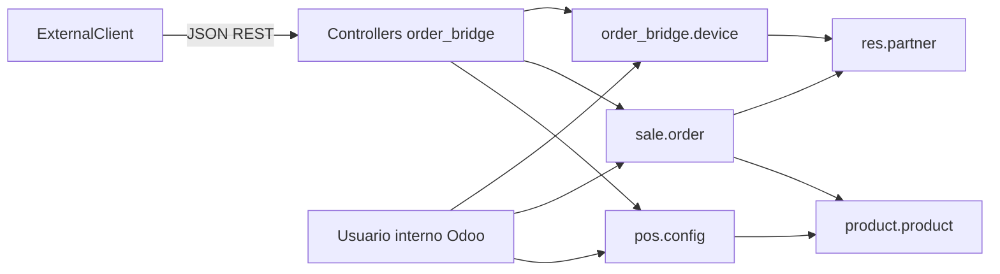

# order_bridge — Arquitectura y decisiones de diseño

Documento de referencia para el módulo **Order bridge** (`order_bridge`) en Odoo 19. Resume el alcance, la arquitectura, los módulos reutilizados y las decisiones tomadas.

## Objetivo

Exponer una **API REST JSON** para clientes externos (apps, kioscos, integraciones) que actúan como canal de pedidos: los usuarios finales se identifican por **teléfono**, el **dispositivo** queda registrado con una clave única generada en el cliente, y un **administrador de la tienda** valida el teléfono (y por tanto el dispositivo activo). Las órdenes se almacenan en Odoo; debe quedar claro qué pedidos provienen de **dispositivos aún no validados**.

## Actualización desde `mobile_order`

Si la base de datos tenía instalado el addon **`mobile_order`** (carpeta y nombre técnicos antiguos):

1. **Antes** de arrancar Odoo con solo la carpeta `order_bridge`, ejecuta en PostgreSQL (o equivalente):

   ```sql
   UPDATE ir_module_module SET name = 'order_bridge' WHERE name = 'mobile_order';
   UPDATE ir_model_data SET module = 'order_bridge' WHERE module = 'mobile_order';
   ```

2. Sustituye el código del addon: elimina `mobile_order` y despliega `order_bridge` en el mismo `addons_path`.

3. Actualiza el módulo: `-u order_bridge`. El script `migrations/19.0.2.0.0/pre-rename_mobile_order.py` renombra tablas, columnas y metadatos ORM del esquema antiguo.

Instalaciones nuevas no necesitan el paso SQL.

## Módulos Odoo reutilizados (Community)

| Módulo | Uso |
|--------|-----|
| **sale** | `sale.order` / `sale.order.line`, estados `draft` → `sent` → `sale` → `cancel`. |
| **product** | Catálogo (`product.product`), precios, venta (`sale_ok`). |
| **point_of_sale** | `pos.config`, `pos.category`, y la misma lógica de dominio que el TPV (`product.template._load_pos_data_domain`) para alinear el catálogo API con un punto de venta concreto. |
| **contacts** (base) | `res.partner` y campo `phone`. |
| **phone_validation** | Normalización de números vía `phone_format` (E.164 cuando es posible). |

Opcionales a futuro: **sale_management** (plantillas), **rpc** solo como referencia de patrones HTTP/JSON en core (este módulo no usa `/json/2`).

### Catálogo API y TPV

- En **`res.company`** el campo **`order_bridge_pos_config_id`** enlaza **un único** `pos.config` por compañía con el catálogo expuesto por la API.
- Configuración: **Ajustes → Punto de venta** (bloque «Order bridge») o pestaña **Order bridge** en el formulario de la compañía.
- Si no hay configuración enlazada, las rutas de catálogo y la creación de pedidos desde la API responden **503** con `error: configuration`.
- Los productos expuestos cumplen el mismo dominio que el POS: compañía del TPV, `available_in_pos`, `sale_ok`, y si el TPV tiene **Restringir categorías**, filtro por `pos_categ_ids` como en Odoo estándar.
- Filtros opcionales en listado: `category_id` (categoría interna de producto), `pos_category_id` (categoría POS, `child_of`).

## Principios de diseño

1. **Sin usuarios Odoo para clientes finales**
   No portal ni `res.users` por cliente. Identidad = `device_key` + vínculo a `res.partner`.

2. **Lo que se valida es el dispositivo ligado al teléfono**
   El usuario introduce el teléfono en el cliente; la app genera y guarda un `device_key` (p. ej. UUID v4). El backend registra `phone` + `device_key`. Tras la validación administrativa, ese dispositivo se considera validado.

3. **Un teléfono, un dispositivo activo**
   Si se registra un nuevo `device_key` para el mismo teléfono normalizado, los dispositivos anteriores con ese teléfono se **desactivan**. El nuevo queda pendiente de validación de nuevo (**re-validación** por seguridad).

4. **Pedidos antes de validar**
   La API **permite crear pedidos** con dispositivo no validado. En backend, el formulario y listados de `sale.order` muestran el estado **actual** de validación del dispositivo vinculado (`order_bridge_device_phone_validated`, relacionado con `order_bridge.device.phone_validated`), útil para informes y filtros; el JSON de la API expone el mismo criterio en `device_validated`.

5. **Órdenes creadas por administrador**
   Origen `order_bridge_origin = 'admin'`, sin `order_bridge_device_id`. Visibles en el cliente junto a las del usuario (`partner_id` común), con referencia de puente cuando aplica.

6. **API stateless orientada a JSON**
   Respuestas JSON planas (`make_json_response`), rutas `auth='public'`, `csrf=False`, y autorización por cabecera `Authorization: Bearer <device_key>` resuelta en código (no confundir con API keys de `res.users`).

## Inventario: qué debe cumplir un producto para mover stock

El módulo depende de **sale_stock**. Al crear un pedido por API, `sale.order` se **confirma en automático** (`_order_bridge_try_confirm` → `action_confirm`), igual que un pedido manual confirmado.

**Producto almacenable (descuento / reserva según Odoo estándar)**

- **Tipo:** `consu` en la plantilla (**Bienes** en la UI). No aplica a **Servicio** ni **Combo** (Odoo fuerza `is_storable` a falso si el tipo no es bienes).
- **Rastrear inventario** (`is_storable` / *Track Inventory*): debe estar activo en `product.template` para que el producto sea tratado como inventariable. Si está desactivado, no se exige stock libre en la validación Pydantic (`validate_order_lines_stock` omite esas líneas) y no se generan movimientos de stock como producto almacenable.
- **Almacén:** debe existir al menos un `stock.warehouse` para la compañía del catálogo; si no, la API responde error al validar el pedido.

**Momento en que “baja” la cantidad a mano**

- Tras la confirmación, `sale_stock` crea las entregas; la **cantidad física disponible** suele reducirse cuando el **albarán de salida se valida** (estado hecho), no solo al confirmar el pedido (puede haber reserva intermedia según configuración de la ruta y reglas de almacén).

## Modelos de datos

### `order_bridge.device`

Registro por dispositivo: `device_key` (único), `partner_id`, `phone` (normalizado), `phone_validated`, `active`, fechas de registro y última actividad, `device_info` opcional.

### Extensiones

- **`res.company`**: `order_bridge_pos_config_id` → `pos.config` usado por la API para esa compañía.
- **`res.partner`**: relación a dispositivos; campos calculados almacenados `order_bridge_registered`, `order_bridge_phone_validated`; contador de pedidos del puente (no almacenado).
- **`sale.order`**: `order_bridge_origin` (`app` | `admin`), `order_bridge_device_id`, `order_bridge_device_phone_validated` (lectura del `phone_validated` del dispositivo vinculado), `order_bridge_ref` (secuencia tipo `OB-00001`), `order_bridge_pos_config_id` (TPV aplicable al crear desde la API).

## API REST (prefijo `/api/order_bridge/`)

| Método | Ruta | Auth |
|--------|------|------|
| POST | `/register` | Ninguna (body JSON) |
| GET | `/openapi.json` | Ninguna (documentación del contrato) |
| OPTIONS | `/*` | CORS preflight |
| GET | `/status` | Bearer `device_key` |
| GET | `/categories` | Bearer |
| GET | `/products`, `/products/<id>` | Bearer |
| POST | `/orders` | Bearer |
| GET | `/orders`, `/orders/<id>` | Bearer |
| POST | `/orders/<id>/cancel` | Bearer |
| GET | `/profile` | Bearer |

Listados: paginación `limit` / `offset` donde aplica. En JSON de pedidos, la referencia legible se expone como `order_ref` y el origen como `origin`.

### Contrato OpenAPI y clientes TypeScript

- **Especificación:** [`docs/openapi.json`](openapi.json) (OpenAPI 3.1), generada desde los modelos Pydantic en `schemas/`.
- **Por HTTP (recomendado, siempre disponible):** `GET /order_bridge/static/openapi.json` (sin autenticación). Odoo sirve los ficheros bajo `/order_bridge/static/` **antes** de enlazar base de datos, así que esta URL responde **200** aunque no haya `?db=` en la primera visita. Mismo JSON que el generador escribe en [`static/openapi.json`](../static/openapi.json) y en [`docs/openapi.json`](openapi.json).
- **Alternativa bajo el prefijo de la API:** `GET /api/order_bridge/openapi.json` — añade las mismas cabeceras **CORS** que el resto de rutas `/api/order_bridge/*`. Requiere que la petición use el despachador con base de datos (sesión con BD elegida o `?db=NOMBRE_BD` si hay varias) y que el proceso haya cargado el controlador (tras `-u order_bridge` o reinicio). Si aquí ves **404** pero el módulo está instalado, reinicia Odoo o usa la URL `static` anterior.
- **Regenerar** tras cambiar cuerpos de petición, respuestas o rutas:

  ```bash
  python3 own_modules/order_bridge/scripts/export_openapi.py
  ```

  Hacer commit del JSON actualizado. Los tests `TestOrderBridgeOpenapi` comprueban que el fichero coincide con el generador.

- **Aplicación TypeScript en otro repositorio:** generar tipos (y opcionalmente helpers) con [`openapi-typescript`](https://github.com/drwpow/openapi-typescript); el primer argumento admite **URL o ruta local**:

  ```bash
  npx openapi-typescript https://TU_DOMINIO/order_bridge/static/openapi.json -o src/order-bridge-api.d.ts
  ```

  Sustituye `TU_DOMINIO` por el host (en local suele ser `http://localhost:8069`). Si necesitas CORS explícito desde un origen distinto, puedes usar en su lugar `https://TU_DOMINIO/api/order_bridge/openapi.json` cuando la ruta API esté activa. También vale un fichero local (`./docs/openapi.json`) o la URL raw en Git.

## Autenticación en código (`@api_device_auth`)

1. Lee `Authorization: Bearer <token>`.
2. Busca `order_bridge.device` activo con ese `device_key`.
3. Si no existe → 401.
4. **No** bloquea si `phone_validated` es falso (solo afecta a cómo se informa el estado en pedidos y API).
5. Actualiza `last_activity` en el dispositivo.
6. Inyecta dispositivo y partner en el controlador (vía `sudo()` acotado a datos del dispositivo).

## Seguridad operativa

- Tras validar el dispositivo, las operaciones quedan acotadas al `partner_id` del dispositivo (no se acepta `partner_id` arbitrario del cliente).
- `device_key` aleatorio de alta entropía; almacenado en claro en BD (similar al prefijo de API keys de Odoo: secreto largo no elegido por el usuario).
- Registro idempotente: mismo `device_key` devuelve estado actual sin duplicar filas.

## Consideraciones técnicas

- **CORS**: cabeceras en respuestas y manejo `OPTIONS` para clientes HTTP no navegador / herramientas de prueba.
- **Cron**: desactivar dispositivos sin actividad tras N días (parámetro de sistema `order_bridge.device_inactivity_days`).
- **Administración**: menús y acciones para listar dispositivos, validar/revocar, filtrar pedidos del puente por origen y por “dispositivo no validado”.

## Diagrama de componentes (resumen)



## Flujos resumidos

1. **Alta**: Cliente genera `device_key` → POST `/register` con `phone`, `name`, `device_key` → partner + device; admin valida en backend → GET `/status` refleja `validated`.
2. **Pedido**: POST `/orders` con líneas; se crea `sale.order` con `order_bridge_origin=app` y dispositivo vinculado; la validación mostrada en API y backend refleja el estado actual del dispositivo.
3. **Cambio de dispositivo**: nuevo `device_key` + mismo teléfono → dispositivos previos con ese teléfono inactivos → nuevo pendiente de validación.

---

## Documentación adicional

- [Ejemplos curl / pruebas manuales](API_EXAMPLES.md)

---

*Última alineación con el plan funcional acordado para el proyecto.*

Actualizar el módulo
python3 odoo-bin -d odoo1 -u order_bridge --stop-after-init
