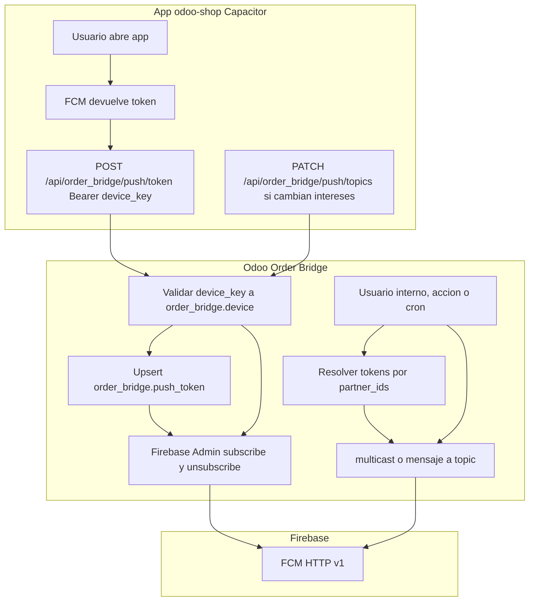
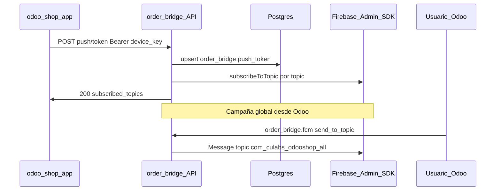

# Notificaciones push (FCM) y Order Bridge

Este documento describe el flujo entre la app móvil **odoo-shop** (Capacitor), la API **Order Bridge** en Odoo, y **Firebase Cloud Messaging (FCM)**. El backend usa el **Firebase Admin SDK** (API HTTP v1 internamente) con credenciales de **cuenta de servicio** (nunca expuestas al cliente).

## Resumen del flujo

1. El usuario se registra con `POST /api/order_bridge/register` (teléfono y `device_key`).
2. Las peticiones autenticadas envían `Authorization: Bearer <device_key>`; el backend resuelve `order_bridge.device` y su `res.partner`.
3. La app obtiene un **token FCM** del SDK en el dispositivo y lo envía con `POST /api/order_bridge/push/token` junto con `platform` y la lista de **topics** a suscribir.
4. Odoo hace **upsert** en `order_bridge.push_token` (un registro por dispositivo) y llama a Firebase para suscribir ese token a cada topic. Si un topic falla, se registra en log y se continúa; la respuesta indica la lista **efectiva** de suscripciones correctas.
5. Los **envíos** de notificaciones desde Odoo (acciones, código interno) **no** usan el Bearer de la app: se hacen con sesión de usuario o procesos con permisos, mediante el modelo abstracto `order_bridge.fcm` (multicast por contactos, o mensaje a un **topic** para campañas, p. ej. `com_culabs_odooshop_all`).

## Configuración en el servidor (Odoo)

- Instalar dependencia Python: `firebase-admin` (incluida en el `requirements.txt` del repositorio).
- Actualizar el módulo `order_bridge` en Odoo tras desplegar código.
- Definir **una** de estas variables de entorno (el código prioriza ruta a fichero frente a JSON en cadena, si existen ambas):

| Variable | Descripción |
| -------- | ----------- |
| `ORDER_BRIDGE_FCM_SERVICE_ACCOUNT_PATH` | Ruta absoluta al JSON de la cuenta de servicio. Recomendado: secret montado en contenedor, solo lectura. |
| `ORDER_BRIDGE_FCM_SERVICE_ACCOUNT_JSON` | Contenido completo del JSON (útil si el PaaS inyecta el secret como variable de entorno). |

- El proceso Odoo debe **poder leer** el fichero o parsear el JSON. Sin credenciales válidas, el registro de token responde **503** con un error de configuración.

## Configuración en Firebase Console

1. Crear o seleccionar un **proyecto** en [Firebase Console](https://console.firebase.google.com).
2. Añadir las aplicaciones **Android** e **iOS** de odoo-shop (package name / bundle id) y descargar los archivos de configuración que pida el cliente móvil (`google-services.json` / `GoogleService-Info.plist`); eso afecta al app id de FCM en el dispositivo, no al JSON de Odoo.
3. Activar / usar **Cloud Messaging** (FCM). El Admin SDK con cuenta de servicio utiliza el envío v1.
4. Crear una **cuenta de servicio** y descargar la **clave JSON** (IAM y administración → Cuentas de servicio → claves, o Ajustes del proyecto de Firebase / cuentas de servicio, según la versión de la consola). Asignar al backend los permisos que exija el proveedor para enviar mensajes (p. ej. roles de mensajería o administración del proyecto según su política).
5. **No** suba este JSON a repositorios públicos. Móntelo en el contenedor o inyéctelo como variable segura.
6. Topic fijo de difusión global usado por la app: `com_culabs_odooshop_all`. La app lo incluye en `subscribe_topics`; para campañas a todos, Odoo puede enviar un mensaje a ese **topic** (no hace falta un topic distinto por usuario en el diseño mínimo acordado).

## Contrato API (extracto)

| Método y ruta | Cuerpo | Respuesta correcta | Errores frecuentes |
| --------------- | ------ | ------------------- | ------------------ |
| `POST /api/order_bridge/push/token` | `fcm_token`, `platform` (`android` \| `ios`), `subscribe_topics` | `200` `{"status":"ok","subscribed_topics":[...]}` | `401` Bearer inválido, `400` validación (topic, plataforma), `503` FCM no configurado |
| `PATCH /api/order_bridge/push/topics` | `subscribe_topics`, `opcional: unsubscribe_topics` (default `[]`) | Igual que arriba | `400` si no existía token (POST previo) |

Especificación OpenAPI generada: `docs/openapi.json` y `static/openapi.json` en el módulo.

## Uso interno en Odoo (envío)

- `env['order_bridge.fcm'].send_to_partner(partner_id, título, cuerpo, data=None)` — todos los tokens de dispositivos activos del contacto, en lotes de 500.
- `env['order_bridge.fcm'].send_to_partner_ids([ids...], título, cuerpo, data=None)`.
- `env['order_bridge.fcm'].send_to_topic('com_culabs_odooshop_all', título, cuerpo, data=None)`.

Requieren un usuario con permisos de **vendedor** o **gestor** de Order Bridge (según implementación; ver el modelo en código). No hay rutas HTTP públicas para el envío.

## Diagrama de flujo (ciclo de vida)



## Diagrama de secuencia (registro vs campaña a topic)



## Pruebas manuales con un token real

1. Configure `ORDER_BRIDGE_FCM_SERVICE_ACCOUNT_PATH` apuntando al JSON de la cuenta de servicio.
2. Reinicie Odoo, registre un dispositivo vía `POST /register` y copie el `device_key` devuelto o el que haya fijado.
3. Con `curl` (sustituya `TOKEN_FCM` por el token real de la consola o logs de la app):

```bash
curl -sS -X POST "https://SU_HOST/api/order_bridge/push/token" \
  -H "Content-Type: application/json" \
  -H "Authorization: Bearer SU_DEVICE_KEY" \
  -d '{"fcm_token":"TOKEN_FCM","platform":"android","subscribe_topics":["com_culabs_odooshop_all"]}'
```

4. Compruebe en el dispositivo o en la consola Firebase (informes / prueba de notificación) que la suscripción y los envíos posteriores son correctos.
